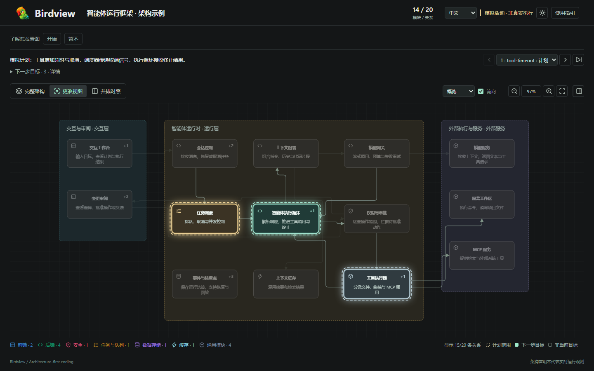

<div align="center">
  
  <h1>Birdview</h1>
  <p><strong>用 Birdview 来改变开发的流程！真正地从关注代码到关注架构！解决 AI coding 的黑盒！</strong></p>
  <p><strong>古法编程最后的优势是感知架构——Birdview 彻底终结了这个理由。</strong></p>
  <p><strong>编程的未来只剩两件事：约束与架构。</strong></p>
  <p>
    
    
    
    
    
    <a href="https://linux.do"></a>
  </p>
</div>

<p align="center">
  <a href="#快速开始">快速开始</a> ·
  <a href="#工作原理">工作原理</a> ·
  <a href="examples/harness-activity.html">交互演示</a> ·
  <a href="https://qiuner.github.io/birdview/">项目介绍页</a> ·
  <a href="README.md">English</a>
</p>

<!-- [English](README.md) -->

Birdview 是一个安装给 AI 编程 Agent 的 Skill，把**架构与约束**放到同一个可审阅的视图中。它帮助你了解项目如何组织、哪些规则适用，以及 AI 准备修改什么。有编码任务时，Agent 先展示地图和修改计划，等待你确认，再实施并记录验证结果。输出为独立、可交互的 HTML 页面，浏览器直接打开即可，无需部署服务。

**[项目介绍页](https://qiuner.github.io/birdview/)：** [qiuner.github.io/birdview](https://qiuner.github.io/birdview/) · **[主题](https://github.com/Qiuner/birdview#readme)：** `agent-tools` `architecture-as-code` `code-visualization` `coding-agents` `developer-tools` `software-architecture`

例如，你调用 Birdview，让 AI“给登录接口增加限流”：

- 普通流程：AI 直接搜索和修改代码，你最后从 diff 中判断它是否漏改或误改。
- Birdview 流程：AI 展示登录模块、适用的接口和安全规则、拟修改文件及判断依据。等待你确认范围后，再实施并记录实际运行的检查。

Birdview 不会自动监听 Agent 的每一步，也不会替代 Git diff、测试或代码审查。它把 Agent 对项目的理解和它声明的修改范围放到同一张架构图上，让你更早发现范围错误，而不是等代码写完再猜。

<p align="center">
  
</p>

> 截图使用仓库内置的虚构智能体运行框架，不代表观测到的生产活动。

## Birdview 能看到什么

日志能告诉你 AI 做过哪些操作，diff 能告诉你哪些代码行变了，但它们很难直接回答：这个改动位于系统的哪一部分？还会影响谁？AI 为什么认为这些文件属于本次任务？

Birdview 把这些信息放进同一个页面：

- **项目全图：** 系统有哪些模块、每个模块负责什么、模块之间怎样连接。
- **项目约束：** 已审查规则的适用条件、具体解释、来源证据和已追踪版本。
- **阅读范围：** 哪些来源已收集、已审查，哪些仍不确定或尚未检查。
- **本次改动：** Agent 声明要触碰哪些模块和文件，目前进行到哪一步。
- **判断依据：** 每个架构结论对应哪些源码文件或代码位置。
- **前后对照：** 在同一布局中比较完整架构与本次改动范围。
- **验证记录：** Agent 实际运行了哪些检查，以及检查是否通过。

集成 HTML 提供架构和约束视图、明暗主题、模块详情及中英文界面。渲染前会检查输入的结构与一致性，CLI 还会导出辅助来源索引。收集到文档不代表其中所有规则自动生效，展示规则也不代表实现已经满足它。

## 快速开始

使用第三方 `skills` CLI 安装：

```sh
npx skills add Qiuner/birdview --skill birdview
```

在 Agent 中发起一个新任务，主动调用技能。**默认仅在明确要求时运行；主动开启项目自动模式后，才会在普通代码修改前触发。**

**Codex：** 输入 `/skills` 选择 Birdview，或输入：

```text
$birdview 展示这个项目的架构和约束，不修改代码
```

**Claude Code：** 输入：

```text
/birdview 展示这个项目的架构和约束，不修改代码
```

DeepSeek Harness 等宿主使用各自的技能选择器，或明确要求使用 Birdview。斜杠命令支持取决于宿主。

检查 Agent 是否交付了可在浏览器阅读的架构与已审查约束页面，包含来源证据及审查缺口。无法完成约束审查时，应说明缺失范围，不编造规则。仅看图的请求交付后结束；编码请求等待你确认已展示的方案。完整的 Codex、Claude Code、DeepSeek Harness 安装方法和验证步骤见[安装指南](docs/installation.zh.md)，本版功能与限制见 [0.3.1 发布说明](docs/release-notes-0.3.1.zh.md)。

### 从源码运行演示

开发或试用仓库内置演示需要 Node.js 18 或更高版本：

```sh
npm ci
npm run validate:examples
npm test
npm run build:demo
```

在浏览器中打开 [`examples/harness-activity.html`](examples/harness-activity.html)。演示中的项目和 Agent 活动均为模拟数据。

## 交流与反馈

遇到安装问题、架构图不准确，或者想交流 Architecture-first Coding，欢迎加入 Birdview 用户交流群。

<p align="center">
  
</p>

<p align="center"><strong>QQ 群：627760389</strong></p>

也可以直接在 GitHub [分享使用反馈](https://github.com/Qiuner/birdview/issues/new?template=usage_feedback.yml)：成功使用、遗漏模块、错误关系或安装问题都可以。不需要提供私有源码，截图和脱敏示例选填。

## 查看器指引

打开集成页面后，可以切换**架构**和**约束**。架构包含项目全图；提供活动记录时，还可查看更改和并排对照。点击模块查看职责、所属文件和源码依据，活动历史记录 Agent 声明的计划、进度与检查结果。

约束页可**按主题**理解规则，或**按目录**追溯文件。双击节点查看具体解释或来源原文，通过**阅读范围**检查审查覆盖和缺口。角色颜色与架构图一致，不代表合规结果。

第一次打开时可跟随**使用指引**浏览，也可以随时跳过或按 Escape 退出。之后仍可从工具栏重新打开指引。

## 显式调用

无论哪种模式，激活后都会先展示地图和拟修改范围，等待你确认后再改代码。同一已确认范围内不重复询问，范围发生实质变化时再确认。仅看图的请求在交付后结束。这是 Agent 执行规则，不是 HTML 页面的强制写入锁。

Birdview **默认按需调用**。普通编码、小修复和功能规划默认不触发，可主动开启项目自动模式。

- **Codex：** 输入 `/skills` 选择 Birdview，或输入 `$birdview`。
- **Claude Code：** 使用 `/birdview` 调用已安装技能。
- **DeepSeek Harness 等宿主：** 使用宿主的技能选择器，或明确要求使用 Birdview；斜杠命令支持取决于宿主。

例如：“使用 Birdview 展示这个项目的架构和约束，不修改代码。”调用只作用于当前任务，不延伸到未来修改。技能在开始流程前检查项目模式；宿主调用配置允许项目主动启用自动模式。

自动模式为可选项：开启后，每次改代码（含小改动）及明确分析涉及模块的规划前都会触发。新项目默认按需；`AGENTS.md` 或 `CLAUDE.md` 中已有的 `Birdview mode: auto` 继续有效。选择或查询项目模式：

```sh
node <skill-root>/scripts/birdview.mjs mode auto --project <project-root>
node <skill-root>/scripts/birdview.mjs mode on-demand --project <project-root>
node <skill-root>/scripts/birdview.mjs mode --project <project-root>
```

初始化为新项目采用 `on-demand`，保留已有 `auto`、`on-demand` 或 `off` 设置。Codex 和 DeepSeek Harness 使用 `AGENTS.md`；Claude Code 添加 `--agent claude-code` 使用 `CLAUDE.md`。不会自动重写其他项目。升级后请新建任务。详见[模式说明](references/modes.zh.md)。

## 直接生成 HTML

通常由 Agent 完成下面的步骤。如果你已经有符合格式的架构文件，也可以手动校验并生成 HTML：

```sh
node scripts/validate.mjs .birdview/architecture.json
node scripts/render.mjs .birdview/architecture.json .birdview/architecture.html
```

如果还要展示 Agent 声明的任务过程，加入活动记录：

```sh
node scripts/validate.mjs .birdview/architecture.json .birdview/activity.jsonl
node scripts/render.mjs .birdview/architecture.json .birdview/activity.html .birdview/activity.jsonl
```

要加入已经收集并审查的约束清单：

```sh
node scripts/birdview.mjs deliver .birdview/architecture.json .birdview/project.html --constraints .birdview/constraints.reviewed.json
```

CLI 生成集成页面及相邻的 `project.sources.html` 辅助导出。来源发现、规则审查和独立约束图生成见[约束流程](references/constraint-graph.zh.md)。

需要同时校验中英文内容时添加 `--bilingual`。`--simulation` 只用于明确标记虚构的演示数据。

## 工作原理

```text
项目源码 ───────> architecture.json ─────────┐
本地规则与审查 ─> constraints.reviewed.json ─┼─> 校验 / 渲染 ─> HTML
Agent 声明 ─────> activity.jsonl ────────────┘
```

`architecture.json` 描述项目模块、职责、文件归属、源码依据和模块关系。可选的 `activity.jsonl` 逐行记录 Agent 声明的任务范围、当前目标、进度和验证结果。`constraints.reviewed.json` 保存收集到的来源、已审查规则及覆盖范围。渲染器校验提供的数据后生成 HTML。

用户实际使用时分为四步：

1. **认识架构与约束：** 阅读源码和本地指令，复用或更新地图，披露审查缺口。
2. **展示修改计划：** 说明涉及模块/文件、预期行为、适用规则和拟运行的检查。
3. **确认修改范围：** 等待你在对话中明确确认后再实施；同一方案复用已有确认，范围实质变化时再次确认。
4. **实施与验证：** 在已确认范围内修改，记录实际检查，说明剩余限制。

确认方案不等于测试通过。你可以明确要求某次任务跳过确认；普通功能请求或开启自动模式不代表豁免。

完整流程见[阶段 1：建立项目地图](references/map-project.zh.md)和[阶段 2：表达变更](references/show-changes.zh.md)。

## 数据契约

| 产物 | 用途 |
| --- | --- |
| `architecture.json` | 项目标识、模块、归属、证据、关系、分组和稳定布局 |
| `constraints.reviewed.json` | 收集的来源、已审查规则、适用性、版本信息和审查覆盖 |
| `activity.jsonl` | 有序的 Agent 声明，包括任务范围、目标、文件、阶段和验证记录 |
| `architecture.html` | 包含地图、可选约束清单及活动历史的查看器 |

Schema 负责约束结构。[`scripts/validate.mjs`](scripts/validate.mjs) 还会检查稳定地图标识、连续序号、合法范围与目标、文件归属以及一致的检查结果等跨记录规则。校验不会证明架构声明真实，也不会证明引用的源码文件存在。

## 项目结构

| 路径 | 内容 |
| --- | --- |
| [`src/`](src) | 契约、CLI 工具、浏览器查看器和网站的 TypeScript 源码 |
| [`schemas/`](schemas) | 架构与活动 JSON Schema |
| [`scripts/`](scripts) | 校验器、独立页面渲染器和文档检查 |
| [`assets/`](assets) | 查看器模板、样式与生成的浏览器构建产物 |
| [`examples/`](examples) | 虚构地图、活动记录和生成后的交互演示 |
| [`references/`](references) | 编写流程、契约、活动与双语指引 |
| [`test/`](test) | 契约、渲染和可选的浏览器级检查 |

## 当前边界

Birdview 0.3.1 使用文件快照：

- 来源收集、规则适用性和合规验证分别表达，审查不完整时必须披露。
- 用户确认保留在对话中，不由 HTML 批准按钮或文件写入锁强制执行。
- 活动由 Agent 声明，Birdview 不会自动观测编码操作。
- 更新后需要重新生成 HTML 并刷新浏览器。
- 尚未实现实时传输、自动刷新和显示确认回执。
- `completed` 事件不能证明检查通过，只有明确记录的检查结果才能表达这一结论。
- 当前包标记为私有，尚未发布到 npm。

## 开发

```sh
npm test                 # 契约与渲染器测试
npm run validate:examples
npm run build:demo       # 重新生成虚构活动演示
node scripts/check-docs.mjs
```

浏览器级检查位于 [`test/viewer.browser.mts`](test/viewer.browser.mts)，需要本地安装 Playwright，或通过 `BIRDVIEW_PLAYWRIGHT_PATH` 指向相应模块。

字段语义和约束见 [Birdview 契约](references/contract.zh.md)。文档修改必须遵循 [CONTRIBUTING.zh.md](CONTRIBUTING.zh.md) 中的双语规则。

## 许可证

采用 [MIT 许可证](LICENSE)。Copyright (c) 2026 Qiuner。
第三方许可证声明保留在 [THIRD_PARTY_NOTICES](THIRD_PARTY_NOTICES) 中。

发版准备见[发布检查清单](docs/releasing.zh.md)。

### 技能兼容性体检

当你要检查已安装技能能否一起触发时，在 Codex 使用 `$birdview-compatibility`，在 Claude Code 使用 `/birdview-compatibility`。体检会先盘点生效的技能根目录，再读取相关技能正文，对比触发范围、调用模式、写权限和确认门槛，最后输出重复安装、触发重叠及按场景成立的兼容性结论，并列出每条结论使用的证据。

直接运行 CLI 时，同时写出机器可读和人类可读结果：

```sh
node <skill-root>/scripts/birdview.mjs skills audit \
  --project <project-root> \
  --language zh \
  --assessment <project-root>/.birdview/compatibility-assessment.json \
  --write <project-root>/.birdview/compatibility-audit.json \
  --write-markdown <project-root>/.birdview/compatibility-audit.md
```

与 Agent 的对话使用英文时传 `--language en`。该命令对已安装技能保持只读，不会禁用、改写或重排其他技能，也不会生成架构图。修改技能配置前，先阅读 Markdown 报告。
